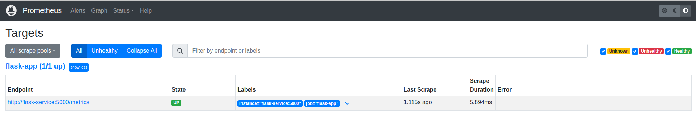
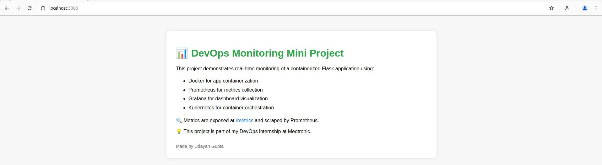
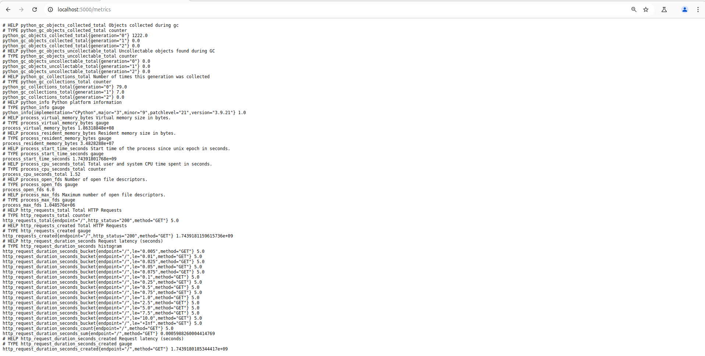
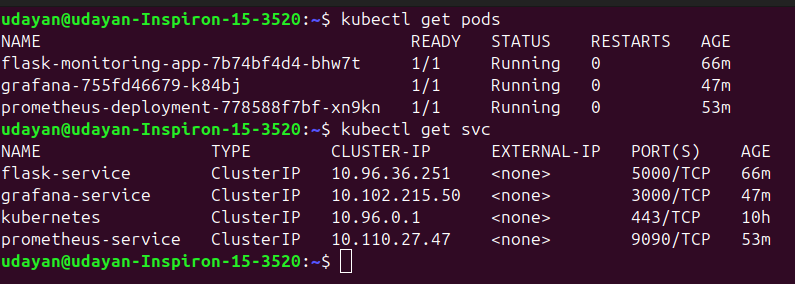

# 🚀 Mini Project 2: Monitoring a Dockerized Flask App using Prometheus & Grafana on Kubernetes

This project demonstrates real-time monitoring of a containerized **Flask application** deployed on **Kubernetes**, with metrics scraped using **Prometheus** and visualized using **Grafana**.

> Built as part of my DevOps Internship at **Medtronic Engineering and Innovation Centre**

---

## 🗂️ Project Structure

<pre>
mini-project-k8s-monitoring/
├── app/
│   ├── app.py
│   └── requirements.txt
├── grafana/
│   ├── grafana-deployment.yaml
│   └── grafana-service.yaml
├── prometheus/
│   ├── prometheus.yml
│   ├── prometheus-configmap.yaml
│   ├── prometheus-deployment.yaml
│   └── prometheus-service.yaml
├── k8s/
│   ├── flask-deployment.yaml
│   └── flask-service.yaml
├── screenshots/
│   ├── grafana-dashboard.png
│   ├── prometheus-targets.png
│   ├── flask-homepage.png
│   ├── flask-metrics.png
│   ├── kubectl-status.png
│   └── docker-push.png
└── README.md
</pre>

---

## 🧰 Tech Stack

- Flask (Python)
- Docker
- Prometheus
- Grafana
- Kubernetes (Minikube)
- Prometheus Client for Python

---

## 🎯 Project Objectives

- Containerize a Flask app with a `/metrics` endpoint.
- Deploy it to Kubernetes using Minikube.
- Configure Prometheus to scrape metrics.
- Visualize them using Grafana dashboards.

---

## 🔍 Key Metrics Tracked

- HTTP Request Count (`http_requests_total`)
- Request Rate (`rate(http_requests_total[1m])`)
- Latency Histogram (`http_request_duration_seconds`)
- Total Time for Requests (`http_request_duration_seconds_sum`)

---

## 🐳 Docker Hub Image

You can pull the image using:

```
docker pull udyngpaws/flask-monitoring-app:latest
```
---

## 🚀 Running the App Locally

1. Start Minikube
```
minikube start --driver=docker
```
2. Deploy the Flask app
```
kubectl apply -f k8s/
```
3. Deploy Prometheus
```
kubectl apply -f prometheus/
```
4. Deploy Grafana
```
kubectl apply -f grafana/
```
5. Port-forward the services
```
kubectl port-forward svc/flask-service 5000:5000
kubectl port-forward svc/prometheus-service 9090:9090
kubectl port-forward svc/grafana-service 3000:3000
```
---

## 📸 Screenshots

### 📊 Grafana Dashboard


### 📡 Prometheus Targets



### 🌐 Flask App Homepage



### 📈 /metrics Endpoint



### 🔧 Kubernetes Pods & Services



### 🐳 Docker Push


---

## 📌 Notes

- The `venv/` directory is used only for local testing and is excluded from version control.
- `.gitignore` ensures a clean Git history.
- Prometheus scraping interval is configured in `prometheus.yml`.
- This project uses `kubectl port-forward` for simplicity, but can be upgraded to Ingress + NodePort in production.

---

## 🙌 Acknowledgements

Special thanks to **Podili Sravan Kumar**, **Manikanta Nandyala**, **Aravind Ramini** and my manager **Kesari Suresh** from the I&O team at **Medtronic Engineering and Innovation Centre** for their invaluable guidance and support throughout this DevOps internship project.

---

## ✍️ Author

**Udayan Gupta**  
DevOps Intern – Shared Services/DevOps  
Medtronic Engineering and Innovation Centre, Hyderabad
